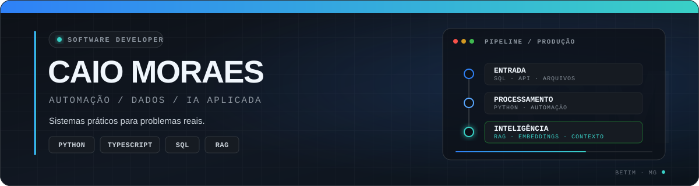

  

  
  
  

## Sobre mim

Sou desenvolvedor de software com experiência em **ambiente industrial**, trabalhando com sistemas que processam grandes volumes de dados e exigem investigação constante de problemas. Gosto de entender o processo antes de escrever código e transformar rotinas manuais em soluções mais simples, rastreáveis e confiáveis.

Hoje atuo principalmente com **Python, integrações, bancos de dados e aplicações web**. Também desenvolvo projetos de IA aplicada com RAG, embeddings e busca vetorial, sempre com foco em uso prático.

> Software útil começa com um problema real bem entendido.

<table>
  <tr>
    <td width="50%" valign="top">
      <strong>Experiência</strong>  
      Desenvolvedor na <strong>Metalsider</strong>, com atuação em sistemas industriais, automação, integração de dados e resolução de problemas que afetam a operação.
    </td>
    <td width="50%" valign="top">
      <strong>Formação</strong>  
      Análise e Desenvolvimento de Sistemas na <strong>PUC Minas — Betim</strong>. Atualmente no 4º período, com conclusão prevista para 2027.
    </td>
  </tr>
</table>

## O que eu desenvolvo

<table>
  <tr>
    <td width="50%" valign="top">
      <strong>Automação e integração</strong>  
      Rotinas em Python, processamento de arquivos e APIs REST para conectar sistemas e reduzir tarefas manuais.
    </td>
    <td width="50%" valign="top">
      <strong>Dados industriais</strong>  
      Coleta, validação, transformação e envio de grandes volumes de dados com logs e rastreabilidade.
    </td>
  </tr>
  <tr>
    <td width="50%" valign="top">
      <strong>Inteligência artificial aplicada</strong>  
      Sistemas RAG, embeddings, bancos vetoriais, OCR e recuperação de informações em documentos técnicos.
    </td>
    <td width="50%" valign="top">
      <strong>Aplicações web</strong>  
      APIs, interfaces e sistemas completos com Python, TypeScript, React e Next.js.
    </td>
  </tr>
</table>

## Stack

  
  
  
  
  

  
  
  
  

  
  
  
  
  
  

## Projetos selecionados

<table>
  <tr>
    <td width="50%" valign="top">
      <h3><a href="https://github.com/CaioM0RAES762/sistema_envio_dados_auto_DATA">Integração industrial de dados</a></h3>
      
Pipeline em Python para ler medições de um sistema supervisório, validar arquivos e enviar dados a uma API com logs, controle de reenvio, retentativas e testes.

      
<code>Python</code> <code>REST API</code> <code>CSV/XLSX</code> <code>pytest</code>

    </td>
    <td width="50%" valign="top">
      <h3><a href="https://github.com/CaioM0RAES762/RagSystem">RAG System</a></h3>
      
Recuperação de conhecimento a partir de manuais industriais, combinando processamento de documentos, OCR, embeddings, busca vetorial e modelos de linguagem.

      
<code>Python</code> <code>RAG</code> <code>ChromaDB</code> <code>OCR</code>

    </td>
  </tr>
  <tr>
    <td width="50%" valign="top">
      <h3><a href="https://github.com/CaioM0RAES762/vogue-platform">Vogue Platform</a></h3>
      
Plataforma de e-commerce em monorepo, com loja, API e painel administrativo, banco relacional, cache, filas e integração de pagamentos.

      
<code>Next.js</code> <code>NestJS</code> <code>PostgreSQL</code> <code>Redis</code>

    </td>
    <td width="50%" valign="top">
      <h3><a href="https://github.com/CaioM0RAES762/mecanica_system">Gestão de manutenção</a></h3>
      
Sistema web para ordens de serviço e rotinas de manutenção mecânica, reunindo frontend, API, banco e infraestrutura local em um monorepo.

      
<code>Next.js</code> <code>Fastify</code> <code>SQL Server</code> <code>Docker</code>

    </td>
  </tr>
</table>

  <a href="https://github.com/CaioM0RAES762?tab=repositories">Ver todos os repositórios →</a>

## GitHub em números

  
  

  

## No que estou trabalhando

- Integrações entre sistemas e automação de rotinas de dados
- APIs e serviços backend com Python e TypeScript
- Aplicações com RAG, embeddings e bancos vetoriais
- Boas práticas de testes, containers e observabilidade

  Aberto a conversas sobre desenvolvimento, automação e inteligência artificial aplicada. 
  <a href="mailto:caio37908@gmail.com"><strong>Vamos conversar →</strong></a>

